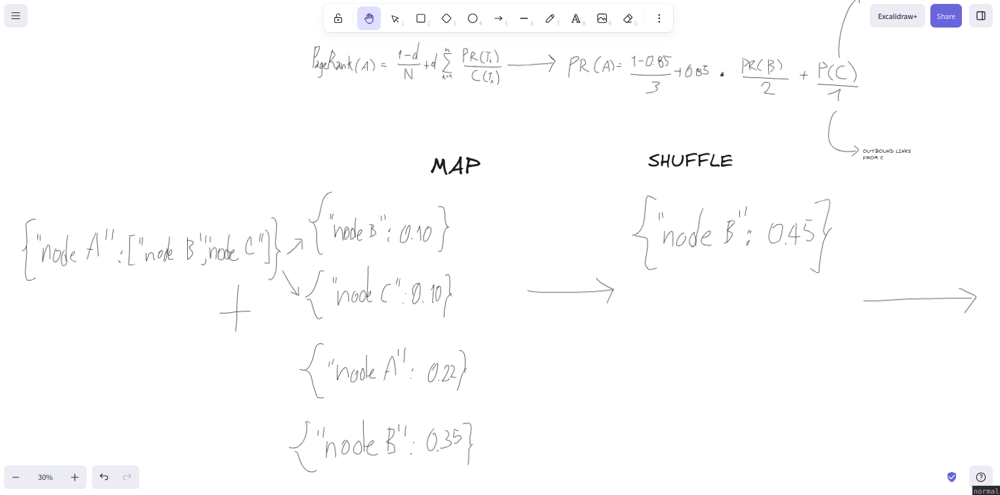

# DESIGN — PageRank with MapReduce

- **Author:** Roy Sandoval
- **Date:** 2026-08-29
- **Deliverable:** Entrega A (design before code)
---

## 0. The constraint everything is derived from

The provided framework exposes a single function:

```python
mapreduce(data, mapper, reducer) -> dict
```

Reading `src/mapreduce_framework.py` line by line, its contract is:

- `data` is a **list**; the `mapper` is called once **per item**, in isolation.
- `mapper(item)` **yields** `(key, value)` pairs.
- After MAP, the framework builds `shuffled[key].append(value)` for every emitted
  pair — this is the **only** grouping mechanism available.
- `reducer(key, values)` is called once per distinct key and returns **one**
  value.
- The result is a plain `dict` `{key: reduced_value}`.
- It runs **exactly one** `MAP -> SHUFFLE -> REDUCE` pass. There is no loop, no
  state carried between calls, no combiner, no secondary sort.

PageRank, by contrast, is **iterative**: the rank vector must be recomputed pass
after pass until it stabilises. So the central design problem is:

> **How do we run an inherently multi-pass algorithm on a framework that offers
> exactly one pass, when the mapper sees one node at a time and the only channel
> between map and reduce is the `(key, value)` pair?**

Three consequences fall out of this, and the rest of the document is the answer to
each:

1. **Iteration must live outside `mapreduce()`** — in a plain Python `while` loop
   that calls `mapreduce()` once per iteration and feeds each output back as the
   next input (§5).
2. **The adjacency list must be re-emitted every pass**, or "who links to whom" is
   lost after the first iteration and cannot be rebuilt (§3).
3. **Dangling rank must be captured and reinjected every pass**, or total rank
   leaks out of the system and the `sum of ranks approx 1.0` invariant breaks
   (§4).

---

## 1. Data representation

Each node of the graph is represented as **one item** in the list passed to
`mapreduce()`. The item is a `(key, value)` tuple:

```
key   = node_id                (a string, e.g. "A")
value = (rank, adjacency_list)  (a float, and the list of OUT-neighbours)
```

Concretely, an input item:

```python
# node A has rank 0.25 and links out to B and C
("A", (0.25, ["B", "C"]))

# node E is a DANGLING node: it has a rank but no out-links
("E", (0.25, []))
```

Design points, each with the reasoning behind it:

| Decision | Why |
| --- | --- |
| One item **per node**, never per edge | The mapper receives one item at a time; a per-node item lets a single `mapper` call both emit the node's rank contributions **and** preserve its adjacency. A per-edge item could not carry the node rank cleanly. |
| `adjacency_list` holds **out-links** (out-neighbours) | PageRank pushes rank *forward* along out-links: node `Q` sends `rank(Q)/outdeg(Q)` to each page it links to. The mapper needs `Q`'s out-links, not its in-links. Confusing the two is a classic error (see §8). |
| Dangling node = `adjacency_list == []` | A dangling node is defined by having **no out-links**. This is directly detectable from the item, with no global information. |
| `rank` initialised to `1 / N` | Uniform prior; total rank is exactly `1.0` at iteration 0, which is the starting point of the sum invariant. |
| The input list contains **every node exactly once** | Guarantees every node is processed each pass, including nodes that receive no incoming rank (§3). |

**What information is local vs global at the start of an iteration:**

- **Local to one item:** the node's id, its current `rank`, its `adjacency_list`.
- **Global to the whole iteration:** `N` (node count), `d` (damping factor,
  `0.85`), and `dangling_sum` (total rank sitting on dangling nodes this pass).
  How these three globals are made available to the `mapper`/`reducer` under this
  restrictive interface is answered in §4.

---

## 2. Key–value schema per phase

This is the heart of the design, so it is fully specified and then traced through
a concrete graph.

### 2.1 The graph used for the trace

```
A -> B, C
B -> C
C -> A
E ->            (dangling: no out-links)
```

`N = 4`. Damping `d = 0.85`. Start every rank at `1/N = 0.25`.
Because `E` is dangling and holds `0.25`, `dangling_sum = 0.25` for this pass
(computed by the outer loop — see §4).



### 2.2 MAP — what the `mapper` emits per node

For an input item `(U, (r, A))`, the `mapper` emits **two kinds of messages**:

| Message type | Key | Value | Semantic purpose |
| --- | --- | --- | --- |
| `STRUCT` | `U` (the node itself) | `("STRUCT", A)` | Carries `U`'s **own adjacency list** through the pass so the `reducer` can re-attach it to the new rank. Emitted **once per node**, dangling or not. |
| `RANK` | `v`, for **each** `v` in `A` | `("RANK", r / len(A))` | The rank contribution `U` pushes to out-neighbour `v`: an equal share of `U`'s rank. Emitted `len(A)` times. **Not emitted at all if `A` is empty** (dangling node). |

Total messages per pass: **`N` STRUCT messages + `E` RANK messages** (`E` = number
of directed edges).

The `mapper` in pseudo-code:

```
def mapper((U, (r, A))):
    yield (U, ("STRUCT", A))          # always: preserve structure
    if len(A) > 0:                    # dangling guard -> no division by zero
        share = r / len(A)
        for v in A:
            yield (v, ("RANK", share))
```

Note the dangling guard: `r / len(A)` is only ever evaluated when `len(A) > 0`, so
**a dangling node can never cause a divide-by-zero**. A dangling node contributes
its `STRUCT` message and nothing else; its rank is handled globally in §4.

**Trace — every message emitted for the example graph (all ranks = 0.25):**

| Node | STRUCT message | RANK messages |
| --- | --- | --- |
| `A` (r=0.25, A=[B,C]) | `(A, ("STRUCT", ["B","C"]))` | `(B, ("RANK", 0.125))`, `(C, ("RANK", 0.125))` |
| `B` (r=0.25, A=[C]) | `(B, ("STRUCT", ["C"]))` | `(C, ("RANK", 0.25))` |
| `C` (r=0.25, A=[A]) | `(C, ("STRUCT", ["A"]))` | `(A, ("RANK", 0.25))` |
| `E` (r=0.25, A=[]) | `(E, ("STRUCT", []))` | *(none — dangling)* |

4 STRUCT + 4 RANK = 8 messages (`N = 4`, `E = 4`).

### 2.3 SHUFFLE — what gets grouped by key

The framework groups **all values that share a key** into a list. For a node `P`,
the `reducer` receives:

```
values(P) = [ exactly one ("STRUCT", A_P) ]  ++  [ zero or more ("RANK", x) ]
```

The single `STRUCT` entry is always present because **`P` emitted its own STRUCT
message keyed to itself** in MAP. The `RANK` entries are one per in-link that
carried rank this pass.

**Trace — reducer input after SHUFFLE:**

| Key `P` | `values(P)` handed to the `reducer` |
| --- | --- |
| `A` | `[ ("STRUCT", ["B","C"]), ("RANK", 0.25) ]` |
| `B` | `[ ("STRUCT", ["C"]), ("RANK", 0.125) ]` |
| `C` | `[ ("STRUCT", ["A"]), ("RANK", 0.125), ("RANK", 0.25) ]` |
| `E` | `[ ("STRUCT", []) ]` |

`E` receives **only** its STRUCT message — no page links to it — and it still
appears as a key, so it is not lost.

### 2.4 REDUCE — what the `reducer` returns

For key `P` with `values(P)`:

```
def reducer(P, values):
    A_P = None
    rank_sum = 0.0
    for tag, payload in values:
        if tag == "STRUCT":
            A_P = payload                 # recover P's adjacency
        elif tag == "RANK":
            rank_sum += payload           # aggregate contributions by destination
    new_rank = (1 - d) / N  +  d * (dangling_sum / N)  +  d * rank_sum
    return (new_rank, A_P)                # SAME shape as an input value
```

`d`, `N` and `dangling_sum` are the iteration-global values (§4).

The return value `(new_rank, A_P)` has **exactly the same structure as an input
`value`**, which is what makes the output of one pass a legal input to the next.

**Trace — reducer output.** With `d = 0.85`, `N = 4`, `dangling_sum = 0.25`:

```
base = (1 - 0.85)/4 + 0.85 * (0.25 / 4)
     = 0.0375 + 0.053125
     = 0.090625            # every node gets this
```

| `P` | `rank_sum` | `new_rank = base + 0.85 * rank_sum` | returned item |
| --- | --- | --- | --- |
| `A` | `0.25` | `0.090625 + 0.2125  = 0.303125` | `("A", (0.303125, ["B","C"]))` |
| `B` | `0.125` | `0.090625 + 0.10625 = 0.196875` | `("B", (0.196875, ["C"]))` |
| `C` | `0.375` | `0.090625 + 0.31875 = 0.409375` | `("C", (0.409375, ["A"]))` |
| `E` | `0.0` | `0.090625 + 0.0     = 0.090625` | `("E", (0.090625, []))` |

**Sum check:** `0.303125 + 0.196875 + 0.409375 + 0.090625 = 1.000000`. The
invariant holds exactly.

The `dict` returned by `mapreduce()` is
`{"A": (0.303125, ["B","C"]), "B": (0.196875, ["C"]), "C": (0.409375, ["A"]), "E": (0.090625, [])}`,
which the outer loop turns back into a list of items for iteration 2.

---

## 3. Preserving the graph structure

### 3.1 Why adjacency must survive every iteration

PageRank's update for node `P` at pass `k+1` needs, for every page `Q` that links
to `P`, the quantity `rank_k(Q) / outdeg(Q)`. That means **at pass `k+1` we still
need to know `Q`'s out-links** — the same edges we used at pass `k`. The edge set
never changes, but the framework gives the mapper only the current item and keeps
no state, so if an iteration's output does not physically contain the adjacency
lists, pass `k+1` has no edges to push rank along.

### 3.2 How the `mapper` preserves it

Every `mapper` call emits, in addition to the rank contributions, **one `STRUCT`
message keyed to the node itself**: `(U, ("STRUCT", A))`. The adjacency list rides
through SHUFFLE as an ordinary value.

### 3.3 How the `reducer` reconstructs it

During SHUFFLE, `U`'s `STRUCT` message lands in the value list for key `U` —
exactly the `reducer` invocation that is computing `U`'s new rank. The `reducer`
scans its `values`, pulls the payload of the `STRUCT`-tagged entry, and returns it
untouched alongside the new rank: `(new_rank, A_U)`. The adjacency is thus
**carried, not recomputed** — the `reducer` never needs to know the global graph,
only the one `STRUCT` message addressed to its own key.

### 3.4 Why emitting only rank contributions is not enough

If the `mapper` emitted only `RANK` messages:

- After iteration 1, `mapreduce()` returns `{node: new_rank}` — **a bare number
  per node, no edges.**
- Building iteration 2's input, the best we can do is `(node, (rank, []))` for
  every node — i.e. **every node now looks dangling.**
- Iteration 2's `mapper` emits no `RANK` messages at all. Every node's
  `rank_sum` is `0`. Every `new_rank` collapses to the teleport term
  `(1-d)/N = 0.0375` (plus the dangling term, which now covers the entire graph).
- The rank vector is destroyed after a single real iteration. The algorithm
  silently produces the uniform vector.

This is the single most important reason the schema has **two** message types and
not one, and it is a likely oral-defense question: *"remove the STRUCT message —
what breaks?"* Answer: the graph disappears after pass 1 and PageRank degenerates
to the uniform distribution.

### 3.5 What exactly would be lost

The **out-adjacency of every node** — equivalently, the entire directed edge set
`E`. In-links are never stored explicitly in this design (they are reconstructed
each pass as the set of `RANK` messages arriving at a key), so losing the
out-adjacency loses *all* structural information.

---

## 4. Dangling-node handling

### 4.1 A dangling node is not the same as a zero-in-degree node

| | Dangling node | Zero-in-degree node |
| --- | --- | --- |
| Definition | No **out**-links (`adjacency_list == []`) | No **in**-links (no page links to it) |
| Problem it causes | Its rank has nowhere to flow → it "leaks" out of the system each pass | None structurally — it simply receives no `RANK` messages |
| Does it still emit `STRUCT`? | Yes | Yes |
| Does it still appear as a `reducer` key? | Yes (via its own `STRUCT`) | Yes (via its own `STRUCT`) |
| What it receives | teleport term + share of redistributed dangling mass | teleport term + share of redistributed dangling mass + any `RANK` it happens to get |

A node can be both, one, or neither. `E` in the trace is dangling **and**
zero-in-degree; it survives as a key purely because of its self-addressed
`STRUCT` message.

### 4.2 Where dangling rank comes from and where it must go

At the start of pass `k` the total rank is `1.0`, split between non-dangling nodes
(which will push their rank along out-links) and dangling nodes (which cannot).
The rank sitting on dangling nodes is

```
dangling_sum = sum of rank_k(u)  for every u with adjacency_list == []
```

If nothing is done with it, the `RANK` messages only account for the non-dangling
mass, so `sum of new_rank` drops to roughly `(1-d) + d * (1 - dangling_sum) < 1`,
and it keeps shrinking every pass. The standard fix, and the one chosen here, is
to **redistribute the dangling mass uniformly across all `N` nodes**, as if every
dangling node linked to every page:

```
new_rank(P) = (1 - d)/N  +  d * (dangling_sum / N)  +  d * sum(RANK messages to P)
              \_teleport_/    \___dangling term___/     \____contribution term____/
```

### 4.3 How this affects the next PageRank vector

Every node — dangling or not, linked-to or not — gets an equal slice
`d * dangling_sum / N` of the leaked mass added to its new rank. This keeps the
total conserved and lets rank that fell into a dangling node re-enter circulation
on the following pass (the dangling node's new rank, now non-zero, is itself
redistributed next time, and so on until convergence).

### 4.4 Making an iteration-global quantity available under this interface

`dangling_sum` depends on the **whole rank vector**, but the `mapper` sees one
node at a time and the `reducer` sees one key at a time — neither can compute it.
Two facts make this a non-problem:

1. The **outer Python loop already holds the entire rank vector** at the start of
   each pass (it just built the input list from the previous pass's output). A
   single `O(N)` scan gives `dangling_sum` — the same place, and the same cost
   class, as the `L1` convergence check that also lives in the outer loop.
2. `dangling_sum`, `N` and `d` are then injected into the `mapper`/`reducer` as a
   **closure** (or `functools.partial`) built fresh each iteration:

```python
def make_reducer(d, N, dangling_sum):
    def reducer(P, values):
        ...
        return ((1 - d)/N + d*(dangling_sum/N) + d*rank_sum, A_P)
    return reducer

result = mapreduce(items, mapper, make_reducer(d, N, dangling_sum))
```

This **does not modify `mapreduce_framework.py`** — it only closes over values in
the caller's own code, which is ordinary Python. The framework still receives a
plain 3-argument call.

### 4.5 The sum invariant, proven for this treatment

Assume `sum of rank_k = 1`. Split the nodes into dangling `D` and non-dangling
`ND`, so `sum_{u in D} rank_k(u) = dangling_sum` and
`sum_{u in ND} rank_k(u) = 1 - dangling_sum`.

```
sum_P new_rank(P)
  = sum_P [ (1-d)/N ]                         = (1 - d)
  + sum_P [ d * dangling_sum / N ]            = d * dangling_sum
  + d * sum_P (RANK messages to P)
```

The last term: every non-dangling node `Q` emits `RANK` messages that sum to
exactly `rank_k(Q)` (it splits its rank into `outdeg(Q)` equal parts and sends all
of them). Dangling nodes emit none. So
`sum_P (RANK messages to P) = sum_{Q in ND} rank_k(Q) = 1 - dangling_sum`.

```
sum_P new_rank(P) = (1 - d) + d*dangling_sum + d*(1 - dangling_sum)
                  = (1 - d) + d
                  = 1
```

The total is conserved **exactly** (floating-point rounding aside), every pass.
This is precisely the check the assignment's §6.1 test demands.

### 4.6 Alternatives considered and rejected

| Alternative | Why rejected |
| --- | --- |
| `mapper` emits a `RANK` message from each dangling node to **all `N` nodes** | Correct result, but blows the shuffle up by `O(D * N)` — for the large graph, `300 dangling * 10 000 nodes = 3 000 000` extra messages per pass, dwarfing the ~73 000 real ones. |
| Emit dangling rank to one special aggregator key, run a **second `mapreduce()` pass** per iteration to broadcast it | Doubles the number of full passes (and, per Clase 5, the disk re-reads) for a quantity the outer loop can get in one `O(N)` scan. |
| **Drop** the dangling rank, renormalise the vector to sum 1 afterwards | Renormalisation is a global rescale that distorts the *relative* ranking and, more importantly, makes the per-iteration sum drift below 1 before the fix — which is exactly the failure the §6.1 invariant test is designed to catch. |
| Treat dangling nodes as linking **only to themselves** | Keeps the sum at 1 but artificially inflates dangling nodes' own rank and starves the rest of the graph — not the textbook PageRank model. |

The chosen "uniform redistribution via an outer-loop scalar" is the simplest
option that is both correct and cheap, and it is easy to defend in five minutes.

---

## 5. Iteration and convergence

### 5.1 Where the loop lives

**Outside `mapreduce()`**, in a dedicated function, as the assignment requires:

```python
def run_pagerank(graph, d=0.85, max_iter=50, epsilon=1e-6):
    N = len(graph)
    ranks = {node: 1.0 / N for node in graph}          # uniform init
    for iteration in range(max_iter):
        dangling_sum = sum(ranks[u] for u in graph if not graph[u])   # O(N)
        items = [(u, (ranks[u], graph[u])) for u in graph]            # build input
        result = mapreduce(items, mapper, make_reducer(d, N, dangling_sum))
        new_ranks = {u: rank for u, (rank, _adj) in result.items()}   # extract vector
        l1 = sum(abs(new_ranks[u] - ranks[u]) for u in graph)         # L1 distance
        ranks = new_ranks
        if l1 < epsilon:
            return ranks, iteration + 1, True
    return ranks, max_iter, False        # converged flag = False
```

`graph` is the static `{node: [out-neighbours]}` adjacency map loaded once from
the dataset file; it is the authority on structure and never changes. Note the
design carries adjacency through `mapreduce()` anyway (§3) so that the pipeline is
correct *as a MapReduce job* — a real distributed run could not rely on a
process-local `graph` dict.

### 5.2 One MapReduce pass

Steps (b)–(d) above: build the item list from the current vector, call
`mapreduce()` once, read the new `(rank, adj)` pairs out of the result `dict`.

### 5.3 Extracting the new rank vector

`new_ranks = {u: rank for u, (rank, _adj) in result.items()}` — the adjacency
half of each value is only needed to keep the pipeline honest; the convergence
test works on the scalar ranks.

### 5.4 Comparing consecutive vectors — the `L1` criterion

```
L1 = sum over all nodes P of | new_rank(P) - old_rank(P) |
```

Both vectors are indexed by the same node set (every node is always present), so
the difference is well-defined for every `P`. Convergence: **stop when
`L1 < epsilon`**, with `epsilon = 1e-6`. `L1` is the criterion named in §4 of the
assignment; it is a single non-negative number that shrinks toward 0 as the
iteration approaches the stationary vector.

### 5.5 The `max_iter` safeguard

The loop runs at most `max_iter = 50` passes. If `L1 < epsilon` is reached first,
`run_pagerank` returns `(ranks, iterations_used, True)`. If the cap is hit first,
it returns `(ranks, max_iter, False)` — the best vector so far, **plus an explicit
`converged = False` flag** so the caller (and `ANALYSIS.md`) can report that the
run did not converge rather than silently trusting the numbers. For the official
large graph, convergence is expected around 24 passes, well under the cap.

### 5.6 What "convergence" means here

The rank vector is a fixed point of the PageRank update; once reached, another
pass reproduces it (up to `epsilon`), so iterating further is wasted work — which
is exactly the cost that motivates Spark's in-memory model in Clase 5.

---

## 6. Diagram of one iteration


Source file: [`DESIGN_ROYSANDOVAL_iteration.drawio`](DESIGN_ROYSANDOVAL_iteration.drawio)
(draw.io / diagrams.net, editable).

**Reading the diagram.** One iteration is one call to `mapreduce()` wrapped by the
outer Python loop:

1. The outer loop takes the **current graph state** (a list of
   `(node, (rank, adjacency))` items), computes `dangling_sum` from the rank
   vector it holds, and hands the item list to `mapreduce()`.
2. **MAP** runs the `mapper` once per node and splits into two message streams:
   `STRUCT` messages (one per node, key = the node, value = its adjacency) and
   `RANK` messages (one per out-edge, key = the target neighbour, value = the
   rank share; none for a dangling node).
3. **SHUFFLE** groups every message by node key `P`, so each `reducer` call gets
   exactly one `("STRUCT", A_P)` plus zero or more `("RANK", x)`.
4. **REDUCE** rebuilds `A_P` from the `STRUCT` entry, sums the `RANK` payloads
   into `s`, and returns `((1-d)/N + d*(dangling_sum/N) + d*s, A_P)` — the same
   item shape it received.
5. The result is the **next graph state**. The outer loop computes
   `L1 = sum |new_rank(P) - old_rank(P)|`: if `L1 < epsilon` (or `max_iter` is
   reached) it stops with the **final ranks**; otherwise the next state becomes
   the input to the next iteration.

---

## 7. Correctness argument (why this preserves PageRank semantics)

Not a formal proof — an argument that each part of the definition is honoured:

1. **Teleport reaches every node.** Every node is an item, so every node is a
   `reducer` key (its own `STRUCT` guarantees it), and every `reducer` adds
   `(1-d)/N`. No node is skipped.
2. **Every non-dangling node distributes exactly its rank.** The `mapper` splits
   `r` into `len(A)` equal parts and emits **all** of them, one per out-link. The
   parts sum back to `r`. No rank is created or destroyed in MAP.
3. **Dangling rank is accounted for.** Captured as `dangling_sum` by the outer
   loop, reinjected as `d * dangling_sum / N` to every node in REDUCE (§4).
4. **Contributions are aggregated by destination.** SHUFFLE groups all `RANK`
   messages addressed to `P`; REDUCE sums them. This is exactly
   `sum over Q linking to P of rank(Q)/outdeg(Q)`.
5. **Adjacency survives.** The `STRUCT` message carries `A_P` into `P`'s own
   `reducer` call, which returns it unchanged (§3).
6. **The output is a legal next input.** Each `reducer` returns `(new_rank, A_P)`
   — the same shape as an input value — so the loop composes indefinitely.
7. **The rank vector stays normalised.** Proven in §4.5: `sum = 1` exactly, every
   pass, under the uniform dangling redistribution.
8. **Fixed point = PageRank vector.** The per-node update is exactly the
   damping-factor formula from the assignment, so its fixed point is the PageRank
   vector, and the `L1` criterion detects when the iteration has reached it.

The §2 trace is a worked instance of points 2–7 on a 4-node graph, ending with
`sum = 1.000000`.

---

## 8. Design-level complexity analysis

Let `N` = nodes, `E` = directed edges, `I` = iterations to convergence,
`D` = dangling nodes.

| Quantity | Cost | Reasoning |
| --- | --- | --- |
| `STRUCT` messages / pass | `N` | one per node, always |
| `RANK` messages / pass | `E` | one per directed edge; dangling nodes emit none |
| **Mapper output / pass** | `N + E` | sum of the two |
| **Shuffle volume / pass** | `N + E` | every emitted pair is shuffled; nothing is pre-aggregated (no combiner) |
| Reducer work / pass | `O(N + E)` total | key `P` does `O(indeg(P) + 1)` work; summed over all keys = `O(N + E)` |
| Outer-loop work / pass | `O(N)` | build item list + `dangling_sum` scan + `L1` scan |
| **Total work** | `O(I * (N + E))` | `I` independent passes |
| **Peak memory** | `O(N + E)` | the `mapped` list and the `shuffled` dict each hold `N + E` entries; framework is fully in-memory |
| Effect of dangling nodes | `+ O(N)` per pass only | just the outer scalar; **no** extra messages. The rejected "emit to all N" design would have cost `+ O(D * N)`. |

**Dataset sanity check (official `web_graph_large.txt`, from the assignment):**
`N = 10 000`, `E approx 63 000`, converges in `~24` passes.
Per pass: `10 000` STRUCT + `~63 000` RANK = `~73 000` shuffled pairs — matches the
assignment's stated figure. Over 24 passes: `~1.75 million` pairs moved — also
matches. The whole graph is **re-read and re-shuffled from scratch every pass**;
nothing persists in memory between passes at the framework level, which is the
concrete Clase 5 motivation for Spark.

**Data skew / high in-degree.** `preferential_attachment` gives a few hub nodes
`~55–60` in-links versus an average of `~6`. The `reducer` call for a hub receives
`~60` `RANK` messages and becomes the **bottleneck reducer** — reduce time is
governed by `max_P indeg(P)`, not the average. In a real distributed run this hub
key would be the straggler that holds up the whole pass.

**Where a combiner would go (if the framework had one, like Hadoop/mrjob).**
After MAP, before SHUFFLE: a combiner keyed by destination would **pre-sum all
`RANK` messages produced within one map partition that target the same node**,
turning many `("RANK", x)` for a hub into a single `("RANK", partial_sum)`. It
would cut the RANK part of the shuffle from `E` toward
`min(E, partitions * N)` and shrink the hub reducer's input list. `STRUCT`
messages cannot be combined (they are not associative sums). This framework has no
combiner, so the full `E` `RANK` messages always cross the shuffle.

---

## 9. Failure analysis — designs that look reasonable but are wrong

| Flawed design | What breaks |
| --- | --- |
| **Mapper emits only `RANK` contributions** | Adjacency is gone after pass 1; every node looks dangling in pass 2; the vector collapses to uniform `(1-d)/N`. (§3.4) |
| **Forget to re-emit adjacency (no `STRUCT`)** | Same collapse. Also, nodes with no in-links never become a `reducer` key and **vanish from the graph** entirely. |
| **Divide by `len(A)` without a dangling guard** | `ZeroDivisionError` on the first dangling node. The `if len(A) > 0` guard in the mapper is the fix. |
| **Losing nodes that receive no `RANK`** | If a node only appeared as a key when someone linked to it, zero-in-degree and dangling nodes would silently disappear and `N` would shrink each pass, breaking the sum. The self-addressed `STRUCT` message prevents this. |
| **Confusing in-degree and out-degree** | Splitting rank by `indeg` instead of `outdeg`, or storing in-links in the item — gives a completely wrong stationary vector; hubs (high in-degree) would wrongly bleed rank instead of accumulating it. |
| **Putting the iteration loop inside `mapreduce()`** | Impossible without modifying the framework (forbidden), and conceptually wrong: `mapreduce()` is one pass by definition. The loop must be Python code around it. |
| **Applying damping wrong** | e.g. `new = (1-d) + d*s` (no `/N` on the teleport), or damping the teleport term — total rank stops summing to 1 and the ranking is distorted. The formula is `(1-d)/N + d*(dangling_sum/N) + d*s`. |
| **Mishandling dangling rank** | Dropping it → sum decays below 1 every pass; sending it only to nodes that already have in-links → sum still wrong and zero-in-degree nodes starve. Uniform redistribution to all `N` is what keeps the sum at exactly 1 (§4.5). |
| **Not preserving the sum invariant** | If `sum of ranks` drifts from `1.0`, the §6.1 test fails and it is a direct signal the dangling handling is broken — this is the assignment's built-in tripwire. |
| **Using Neo4j / networkx / numpy or another graph engine** | Explicitly forbidden — the assignment requires `mapreduce_framework.py` and the Python standard library only. `src/neo4j.py` exists in the repo but is **out of scope** for this deliverable; the design uses only `mapreduce()`. |

---
